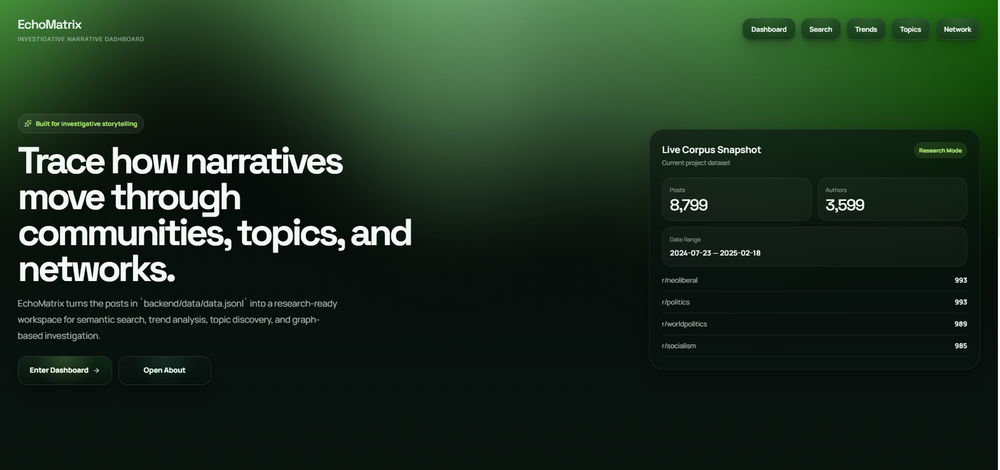
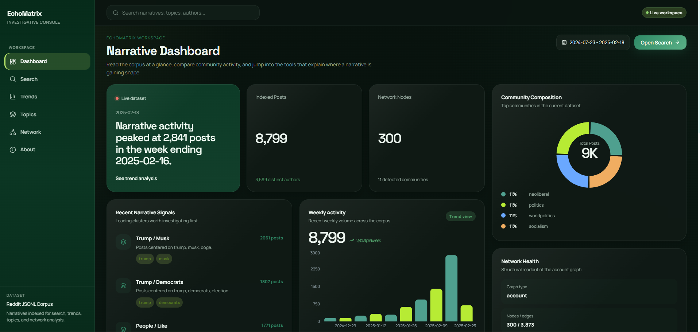
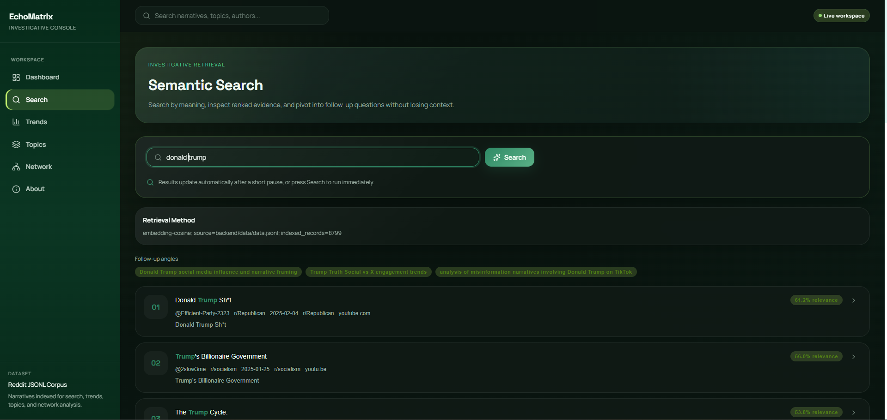
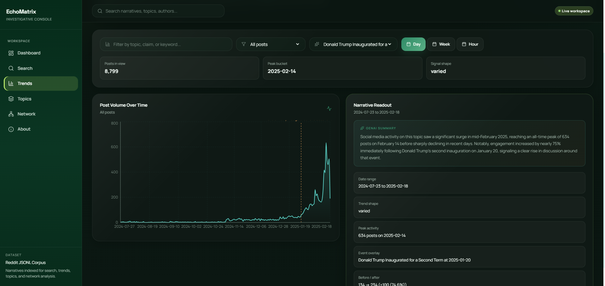
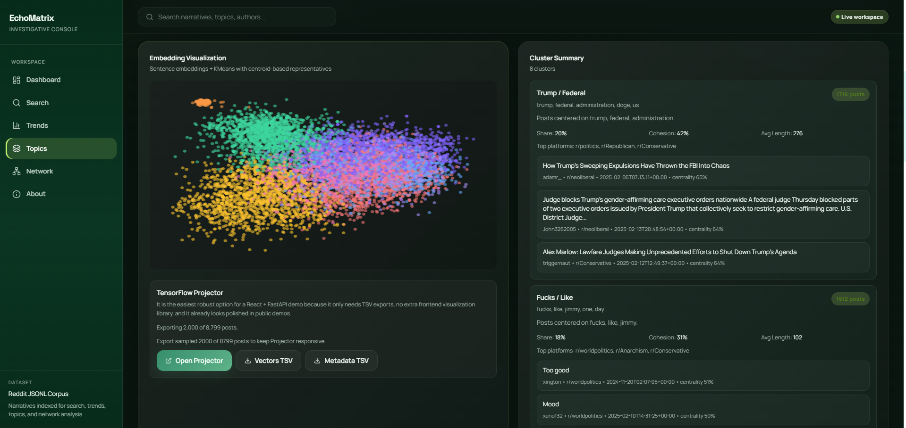
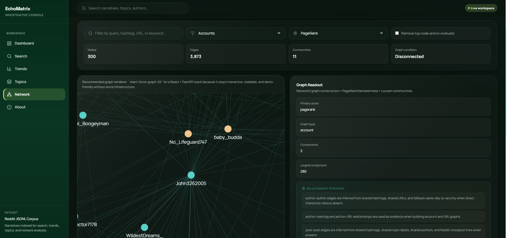
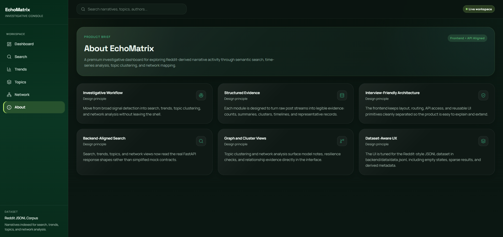
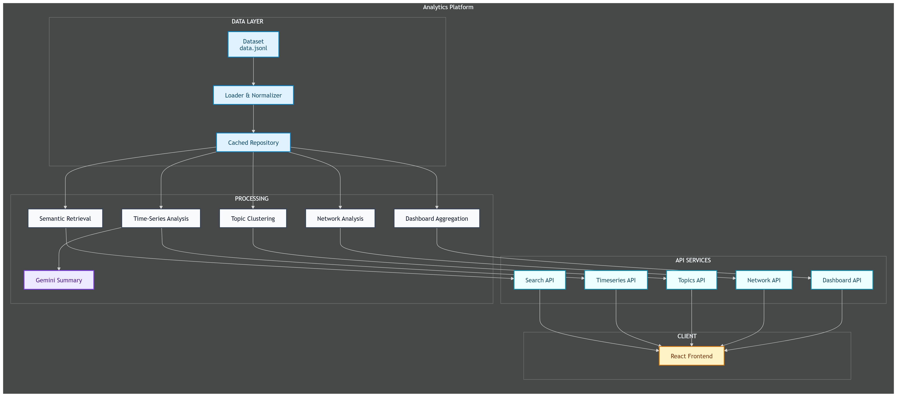
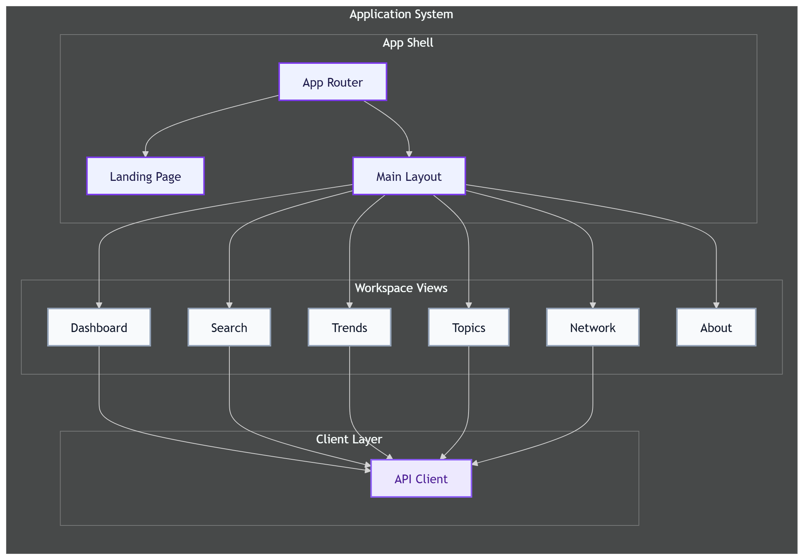
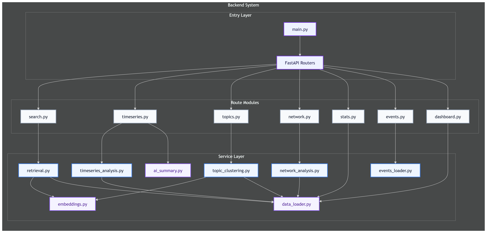

# EchoMatrix

<p align="center">
  Investigative narrative intelligence workspace for semantic retrieval, temporal analysis, topic discovery, and graph-based exploration.
</p>

<p align="center">
  
  
  
  
  
  
  
  
</p>

<p align="center">
  <a href="#demo-preview">Demo Preview</a> •
  <a href="#why-echomatrix">Why EchoMatrix</a> •
  <a href="#feature-set">Feature Set</a> •
  <a href="#architecture">Architecture</a> •
  <a href="#local-setup">Local Setup</a> •
  <a href="#api-surface">API Surface</a> •
  <a href="#project-structure">Project Structure</a>
</p>

---

## Demo Preview

### Live Deployment

```text
Frontend: https://echo-matrix.vercel.app/
Backend:  http://ec2-3-93-52-134.compute-1.amazonaws.com:8000/
```

### Screenshots

#### Landing Page

<p align="center">
  
</p>

#### Dashboard Overview

<p align="center">
  
</p>

#### Semantic Search

<p align="center">
  
</p>

#### Time-Series Trends

<p align="center">
  
</p>

#### Topic Clustering

<p align="center">
  
</p>

#### Network Analysis

<p align="center">
  
</p>

#### About Page

<p align="center">
  
</p>

---

## Why EchoMatrix

EchoMatrix is a full-stack investigative dashboard built to make large narrative datasets legible. Instead of showing generic admin widgets, it turns a Reddit-style JSONL corpus into an analyst workflow:

- search by meaning, not just exact words
- inspect activity over time
- cluster posts into narrative themes
- map structural relationships between communities, links, topics, and actors
- move from signals to evidence inside one connected interface

The project is built around a real dataset at [backend/data/data.jsonl](./backend/data/data.jsonl), not a mock dashboard dataset.

---

## Table Of Contents

- [Why EchoMatrix](#why-echomatrix)
- [Feature Set](#feature-set)
- [Tech Stack](#tech-stack)
- [Architecture](#architecture)
- [Dataset](#dataset)
- [Local Setup](#local-setup)
- [Environment Variables](#environment-variables)
- [Run Commands](#run-commands)
- [API Surface](#api-surface)
- [Project Structure](#project-structure)
- [AI And ML Components](#ml-and-ai-components)
- [Performance And Robustness](#performance-and-robustness)
- [Documentation Map](#documentation-map)
- [Submission Checklist](#submission-checklist)

---

## Feature Set

### 1. Semantic Search

- query posts by meaning instead of strict keyword overlap
- ranked results with relevance score and metadata
- related-query suggestions
- empty, short, and sparse-query handling

### 2. Time-Series Trends

- filter by query
- bucket by hour, day, or week
- group by platform, author, hashtag, or topic
- optional offline event overlay
- AI or fallback plain-language summaries

### 3. Topic Clustering

- embedding-based clustering
- tunable cluster count
- labels, summaries, keywords, representative posts
- embedding export for projector exploration

### 4. Network Analysis

- account, hashtag, URL, post, and topic graphs
- influence scoring with PageRank and betweenness
- community detection
- resilience analysis through top-node removal

### 5. Investigative Dashboard

- cached overview payload for fast first paint
- live dataset stats
- weekly activity
- community composition
- topic signals
- network health
- investigation brief cards

### 6. Landing And Product Storytelling

- Aurora landing page with OGL
- dark investigative visual system
- About content integrated into product flow

---

## Tech Stack

| Area | Technologies |
| --- | --- |
| Frontend | React 19, Vite 8, React Router 7, Axios |
| Visualization | Recharts, react-force-graph-2d, OGL |
| Backend | FastAPI, Uvicorn |
| Data | pandas, numpy |
| Retrieval / ML | sentence-transformers, scikit-learn, UMAP |
| Graph Analysis | NetworkX |
| AI Summaries | Gemini via `google-genai` |
| Config | python-dotenv |

---

## Architecture

EchoMatrix is easiest to understand as a three-layer system:

- data ingestion and normalization
- analysis and API services
- frontend investigation workspace

### System Overview
<p align="center">
  
</p>

### Frontend View

<p align="center">
  
</p>

### Backend View

<p align="center">
  
</p>

### How To Read This Architecture

1. The JSONL dataset is loaded once, normalized, and cached into a reusable repository.
2. Analysis services read from that shared repository instead of reparsing the file every time.
3. Specialized services power search, trends, topics, network analysis, and the dashboard overview.
4. The frontend calls those APIs through one shared client and presents them as investigation workflows.

---

## Dataset

The application is built around:

- [backend/data/data.jsonl](./backend/data/data.jsonl)

This corpus is treated as a Reddit submissions dataset and is normalized by the backend loader into a stable internal record structure.

Useful companion docs:

- [backend/DATA_SCHEMA.md](./backend/DATA_SCHEMA.md)
- [backend/ROBUSTNESS_AUDIT.md](./backend/ROBUSTNESS_AUDIT.md)

---

## Local Setup

### 1. Backend

```powershell
cd backend
python -m venv venv
.\venv\Scripts\Activate.ps1
pip install -r requirements.txt
Copy-Item .env.example .env
uvicorn app.main:app --reload
```

Backend runs by default on:

```text
http://localhost:8000
```

### 2. Frontend

```powershell
cd frontend
npm install
Copy-Item .env.example .env
npm run dev
```

Frontend runs by default on:

```text
http://localhost:5173
```

### 3. Open The App

Start with:

```text
http://localhost:5173
```

---

## Environment Variables

### Backend

Recommended backend `.env`:

```env
GEMINI_API_KEYS=key1,key2,key3,key4,key5
ALLOWED_ORIGINS=http://localhost:5173,http://localhost:3000
```

Gemini can also be configured with:

```env
GEMINI_API_KEY=key1
```

or:

```env
GEMINI_API_KEY_1=key1
GEMINI_API_KEY_2=key2
GEMINI_API_KEY_3=key3
GEMINI_API_KEY_4=key4
GEMINI_API_KEY_5=key5
```

### Frontend

Recommended frontend `.env`:

```env
VITE_API_BASE_URL=http://localhost:8000/api
```

---

## Run Commands

### Backend

```powershell
cd backend
.\venv\Scripts\Activate.ps1
uvicorn app.main:app --reload
```

### Frontend

```powershell
cd frontend
npm run dev
```

### Health Check

```text
http://localhost:8000/health
```

---

## API Surface

### Root And Health

- `GET /`
- `GET /health`
- `POST /dev/reload-data`

### Main API

- `GET /api/dashboard/overview`
- `GET /api/stats`
- `GET /api/search`
- `GET /api/timeseries`
- `GET /api/events`
- `GET /api/topics`
- `GET /api/topics/projector`
- `GET /api/network`

### Example URLs

```text
http://localhost:8000/api/search?q=reading circle
http://localhost:8000/api/timeseries?q=trump&granularity=week
http://localhost:8000/api/topics?n_clusters=8
http://localhost:8000/api/network?graph_type=account
http://localhost:8000/api/dashboard/overview
```

---

## Project Structure

```text
EchoMatrix/
├── docs/
│   ├── architecture/
│   └── screenshots/
├── backend/
│   ├── app/
│   │   ├── core/
│   │   ├── models/
│   │   ├── routers/
│   │   └── services/
│   ├── data/
│   │   ├── .cache/
│   │   ├── data.jsonl
│   │   └── events.json
│   ├── .gitignore
│   ├── .env.example
│   ├── DATA_SCHEMA.md
│   ├── ROBUSTNESS_AUDIT.md
│   ├── requirements.txt
│   └── README.md
├── frontend/
│   ├── public/
│   ├── src/
│   │   ├── assets/
│   │   ├── components/
│   │   │   ├── layout/
│   │   │   ├── search/
│   │   │   ├── ui/
│   │   │   └── visuals/
│   │   ├── pages/
│   │   └── services/
│   ├── .env.example
│   ├── .gitignore
│   ├── index.html
│   ├── package-lock.json
│   ├── package.json
│   ├── vite.config.js
│   └── README.md
├── anshul-prompts.md
├── INSTRUCTIONS.md
├── PRO-TIPS.md
└── README.md
```

This view intentionally focuses on the tracked source and documentation layout, not local-only folders such as `venv/`, `node_modules/`, `dist/`, or `.vite/`.

---

## AI And ML Components

### Semantic Retrieval

- embeddings from `sentence-transformers/all-MiniLM-L6-v2`
- cosine-style semantic ranking
- fallback behavior for weak or tiny corpora

### Time-Series Summaries

- Gemini summary generation through `google-genai`
- multi-key rotation support
- rule-based fallback when Gemini is unavailable

### Topic Clustering

- embedding vectors
- `KMeans`
- TF-IDF keyword labels
- centroid-nearest representative posts

### Network Analysis

- PageRank
- betweenness
- Louvain community detection where available
- resilience analysis with top-node removal

---

## Performance And Robustness

### Performance Improvements Implemented

- cached dataset repository
- serialized loader cache
- embedding warm-up on backend startup
- dashboard overview warm-up on backend startup
- in-memory caches for heavy endpoints
- gzip compression on the backend
- lazy route loading on the frontend

### Robustness Handling

- malformed JSONL rows are skipped safely
- empty and short search queries return valid messages
- sparse and flat time-series outputs return explicit shape information
- topic cluster counts are reduced safely when oversized
- malformed URLs do not break network construction
- disconnected graphs return safe metadata instead of crashing

---

## Documentation Map

- Root project overview: [README.md](./README.md)
- Frontend guide: [frontend/README.md](./frontend/README.md)
- Backend guide: [backend/README.md](./backend/README.md)
- Backend robustness audit: [backend/ROBUSTNESS_AUDIT.md](./backend/ROBUSTNESS_AUDIT.md)
- Dataset schema notes: [backend/DATA_SCHEMA.md](./backend/DATA_SCHEMA.md)
- Prompt log: [anshul-prompts.md](./anshul-prompts.md)
